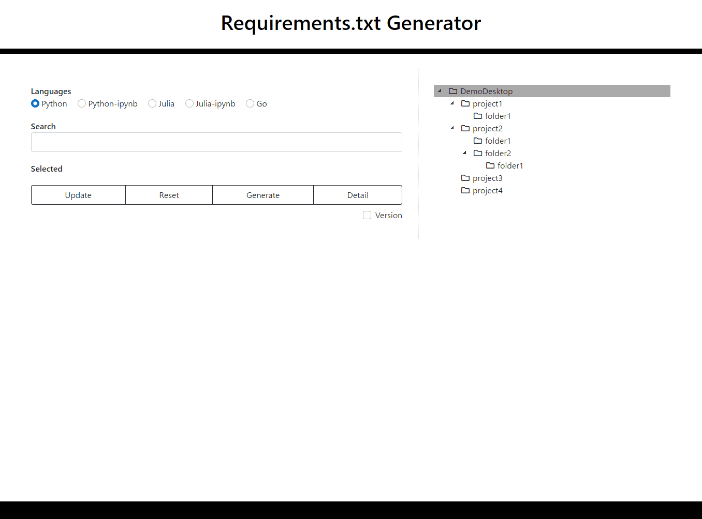

<h1 align="center">Requirements.txt Generator</h1>

 
 
 
 

***

## Supported languages

 - Python
 - Python-ipynb
 - Julia
 - Julia-ipynb
 - Go

***

## Features

 - [x] Windows, Mac, and Linux compatible
 - [x] Select Language
 - [x] Search Folders
 - [x] Detail view
 - [x] Select library
 - [ ] Execute command

***

## Note

If you have a large number of folders on your desktop, it may not work properly.
