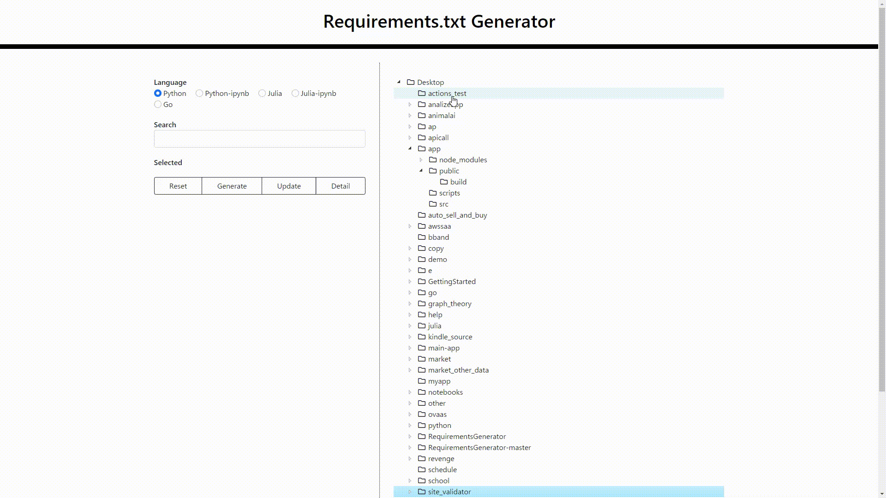

<h1 align="center">Requirements.txt Generator</h1>

 
 
 
 

***

## 機能

 - [x] 言語選択
 - [x] Windows対応
 - [x] Mac対応
 - [x] 詳細表示
 - [ ] ライブラリ選択
 - [ ] コマンドによる実行
 - [ ] version指定の選択
 - [ ] `requirements.txt`の表示
 - [x] 検索

***

## 対応言語

 - Python
 - Python-ipynb
 - Julia
 - Julia-ipynb
 - Go
