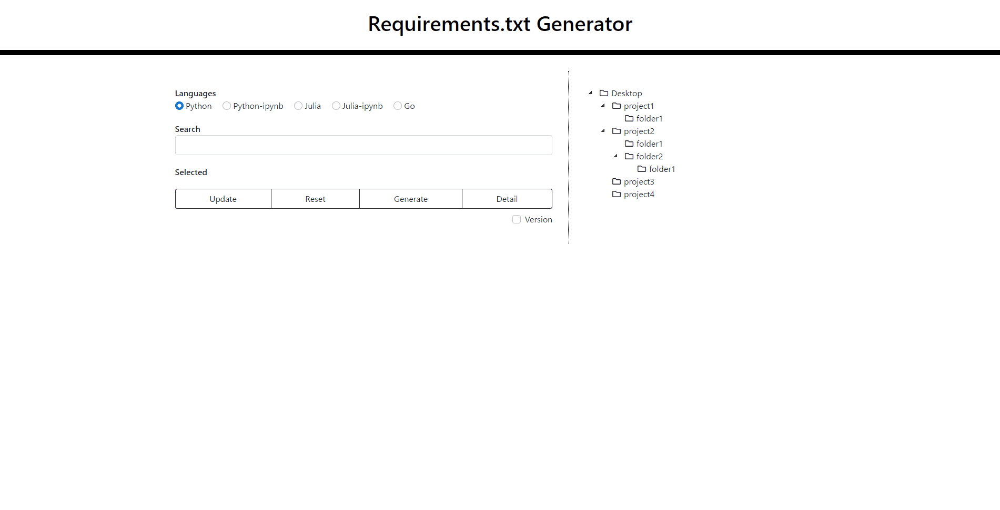

<h1 align="center">requirements.txt Generator</h1>

<div align="center">

[](https://github.com/ogty/RequirementsGenerator/releases/download/v1.0.0/requirementstxt_generator_for_windows.zip)&nbsp;&nbsp;&nbsp;[](https://github.com/ogty/RequirementsGenerator/releases/download/v1.0.0/requirementstxt_generator_for_mac.zip)&nbsp;&nbsp;&nbsp;[](https://github.com/ogty/RequirementsGenerator)

&nbsp;
 
</div>



***

## Features

 - [x] Windows, Mac, and Linux compatible
 - [x] Select Language
 - [x] Search Folders
 - [x] Detail view
 - [x] Select library
 - [x] Select multiple folders
 - [x] Add version
 - [ ] Execute command

***

## Supported languages

 - Python
 - Python-ipynb
 - Julia
 - Julia-ipynb
 - Go

***

## How to install packages for each language

**Python**

```
$ pip install -r requirements.txt
```

**Julia**

```julia
# install.jl
using Pkg; Pkg.add(open(f->readlines(f), "./requirements.txt"))
```

```
$ julia install.jl
```
***

## Note

If you have a large number of folders on your desktop, it may not work properly.
